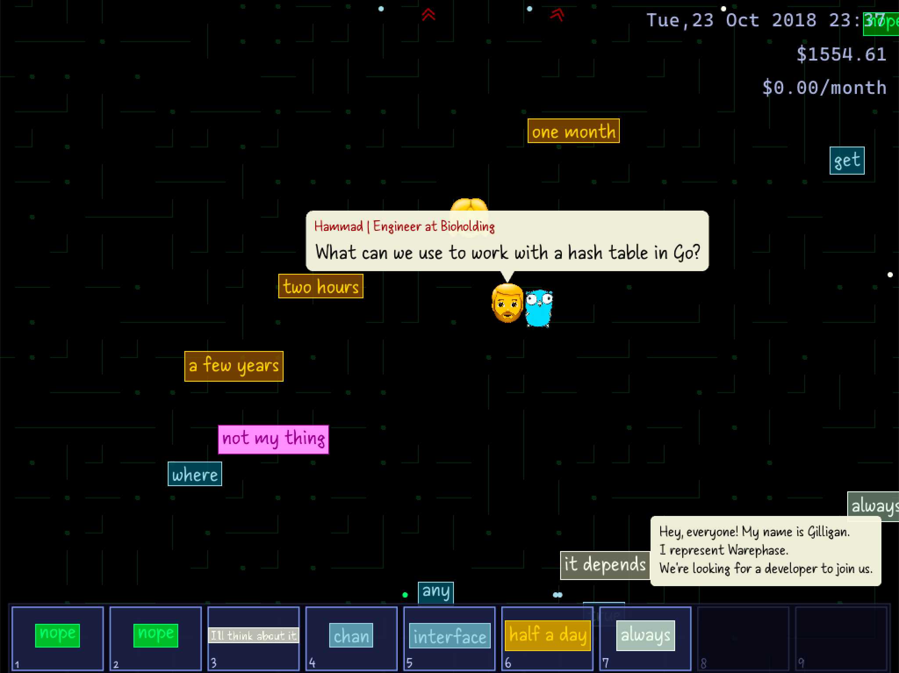

# Hired or Homeless

A top-down game about job interviews. A recruiter gives you a signal when they want to talk to you. Words are your only way to answer, so choose them with care.

Play on [itch.io](https://dqso.itch.io/hired-or-homeless).

You are a developer, and you are lost in the job market. Every company waits for you in three steps: first a recruiter, then a technical specialist, then the owner. They stand in their places on the map and ask you questions, and the technical part can be about Go, C# or JS.

But you cannot type any answer you want. All answers lie on the ground as word tokens, and you can carry only 9 of them. Take the right words, bring them to the interviewer, and get the offer. Take the wrong words, and you go back to the street.

The game is written in Go with Ebitengine.

## Controls

- Move: `WASD` or arrow keys
- Take a token: come closer and press `E`. Drop a token with `1`-`9`
- Interview: come closer to a person and answer the questions with `1`-`9`

You can also turn on these options in the settings:

- Disable the technical interview step
- Start the game with your own house, so you do not pay rent

## Game jam

I made the game in 72 hours for Ludum Dare 59. The theme was **Signal**. The jam had 1208 participants.

These are the [final results](https://ldj.am/59/hired-or-homeless):

| Criteria   | Rank | Score |
|------------|-----:|------:|
| Overall    | #655 |  3.22 |
| Fun        | #618 |  3.06 |
| Innovation | #162 |  3.82 |
| Theme      | #768 |  2.70 |
| Humor      |  #89 |  3.92 |
| Mood       | #603 |  3.32 |

## Credits

Made by Denis Proleev ([github.com/dqso](https://github.com/dqso)).

- Engine: [Ebitengine](https://github.com/hajimehoshi/ebiten), Apache License 2.0
- Font: [Cascadia Mono](https://github.com/microsoft/cascadia-code) - © Microsoft Corporation, SIL Open Font License 1.1
- Font: Stampatello Faceto - free font
- Art and sounds: free assets; music made with AI